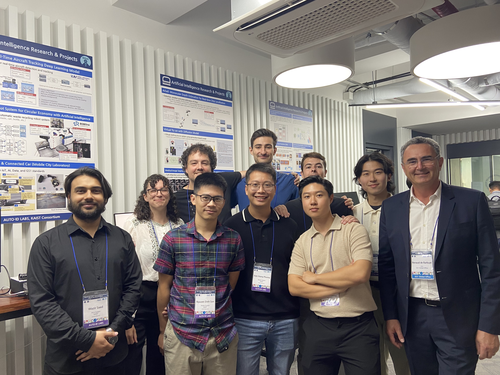
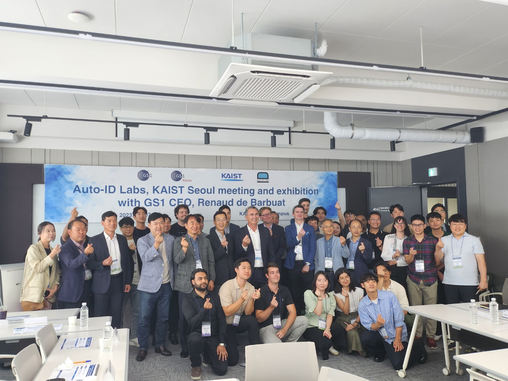
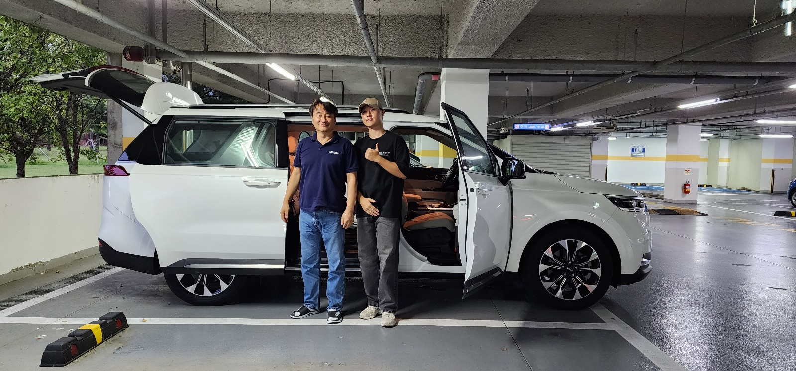

# My Machine Learning Internship Experience at KAIST

## Introduction

In the summer of 2023, I had the incredible opportunity to work as a Machine Learning Research Intern at the Auto-ID Labs, KAIST in Daejeon, South Korea. Over the course of three months, I was immersed in cutting-edge AI research, deploying models on edge devices, and contributing to real-world applications. This blog post reflects on my technical journey, the challenges I faced, and the valuable lessons I learned.

<!--more-->

## Projects and Contributions

### AI Speaker Development

One of the central projects I worked on was building an AI Speaker prototype. This involved:

* **Speech Recognition**: Implementing OpenAI's Whisper model to transcribe spoken input.
* **Response Generation**: Integrating the GPT-3.5-Turbo API to generate natural language responses.
* **Text-To-Speech (TTS)**: Incorporating the Humelo API to convert text responses into human-like speech.

The system was deployed on a Raspberry Pi, offering a compact yet powerful platform for demonstrating conversational AI.

### Deep Learning on Edge Devices

Another significant aspect of my internship involved deploying state-of-the-art deep learning models on edge hardware:

* **YOLOv8** and **FastSAM** for object detection.
* **Ultra-Fast-Lane-Detection-V2** for autonomous driving tasks.

These models were optimized and run on devices like the Xilinx FPGA and NVIDIA Jetson Orin, showcasing the potential for real-time AI processing in constrained environments.

### Lane Detection System

I also developed a lane detection system using footage from a GoPRO Hero11. This system employed Ultra-Fast-Lane-Detection-V2 and ran on an NVIDIA Jetson AGX Orin. To ensure real-time performance, I optimized the model using TensorRT. The final system was capable of issuing lane departure warnings, contributing to safer driving assistance systems.

### Demo Video

<video controls width="640" height="360">
  <source src="../images/kaist-demo.mp4" type="video/mp4">
</video>

### Industry Engagement

During my internship, I helped organize the GS1 Exhibition, a significant event where I had the privilege of presenting my AI work to the CEO of GS1. I also had the opportunity to engage in direct conversations with the CEO, sharing insights about my projects and their potential applications. This experience allowed me to bridge technical work with industry applications and improved my ability to communicate complex concepts to non-technical audiences.

## Challenges and Learnings

Working with edge devices introduced numerous challenges, from hardware limitations to model optimization. I had to ensure that models maintained accuracy while meeting real-time performance constraints. Debugging deployment issues on devices like the Jetson Orin required a deep understanding of both software and hardware intricacies.

Integrating various APIs and frameworks also enhanced my problem-solving skills, particularly when dealing with version incompatibilities or performance bottlenecks.

## Conclusion

My internship at KAIST was a transformative experience. It not only strengthened my technical foundation in machine learning and embedded systems but also gave me a taste of collaborative research and industry engagement. I'm grateful for the mentorship and hands-on opportunities, and I look forward to applying these skills to future AI challenges.

I would like to express my sincere gratitude to my colleagues and professor at KAIST, whose guidance and insights were instrumental in shaping my internship experience. Their support and expertise inspired me to push boundaries and approach challenges with a problem-solving mindset.

If you're passionate about AI and looking to explore its real-world impact, I highly recommend seeking research internships like this one. They are gateways to learning, innovation, and growth.