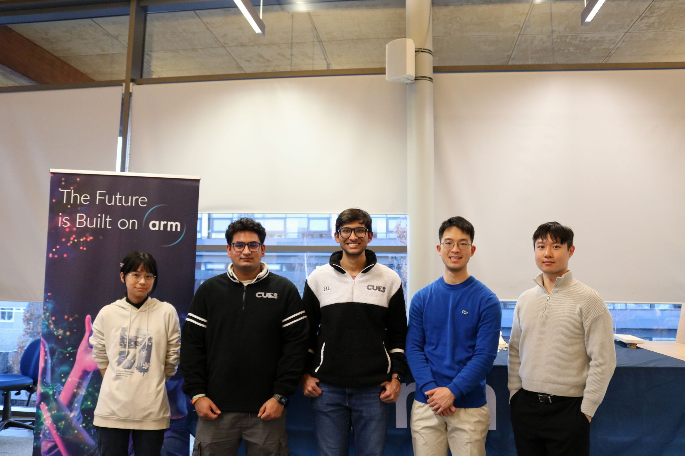

# Agentic AI for Productivity: Highlights from Our 32-Hour Hackathon at Cambridge

## Introduction

We recently wrapped up an exhilarating 32-hour hackathon at the University of Cambridge, organized in collaboration with the Cambridge University Engineering Society (CUES). Themed **"Agentic AI for Productivity,"** the event brought together around 60 enthusiastic engineering and computer science students eager to harness the potential of autonomous AI agents to optimize everyday tasks.

<!--more-->

## Event Highlights

The hackathon aimed to explore how AI can extend human capabilities through intelligent automation. From the very start, participants dove into developing solutions that bridged cutting-edge theory with practical application.

### Innovative Projects

Over the course of the weekend, teams tackled a wide array of challenges, including:

* **Automated Circuit Design**: Leveraging AI to streamline the hardware prototyping process.
* **Interactive Study Tools**: Building intelligent systems to personalize learning experiences.
* **Workflow Automation**: Developing agents to manage repetitive digital tasks more efficiently.

The level of innovation and execution was truly inspiring, demonstrating both technical prowess and creative thinking.

## Acknowledgments

This event would not have been possible without the dedicated efforts of the **CUES Tech Team**:

* Harsh Lunia
* Hanzhang Shen
* Aditya Kalra
* Han (Ceylon) Li

Special thanks also go to our judges and mentors from Arm:

* George Gekov
* Kieran Hejmadi

Their expert guidance and feedback were invaluable throughout the event. We are also deeply grateful to **Imad Georges Badran**, whose behind-the-scenes coordination was essential to the hackathon's success.

## Looking Ahead

The energy and ingenuity displayed during the hackathon reaffirmed our belief in the transformative potential of AI-driven productivity tools. We're excited to see how these projects continue to evolve and inspire future innovation.

Participants are encouraged to showcase their work on our [Academic Projects page](https://github.com/arm-university/Arm-Developer-Labs) for an opportunity to be recognized by Arm and contribute further to the academic and developer community.

## Conclusion

Bringing together a diverse group of forward-thinking students, the Agentic AI Hackathon was a celebration of collaboration, curiosity, and cutting-edge technology. We look forward to building on this momentum and continuing to support initiatives that push the boundaries of what AI can achieve.

Stay tuned for future events and updates—and let’s keep building the future of intelligent productivity, together.
