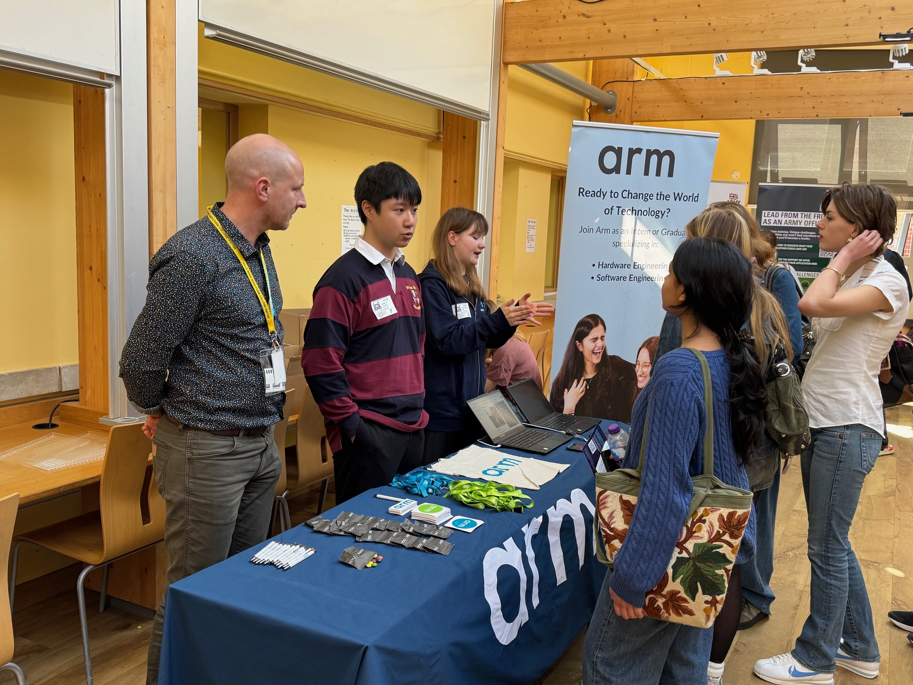
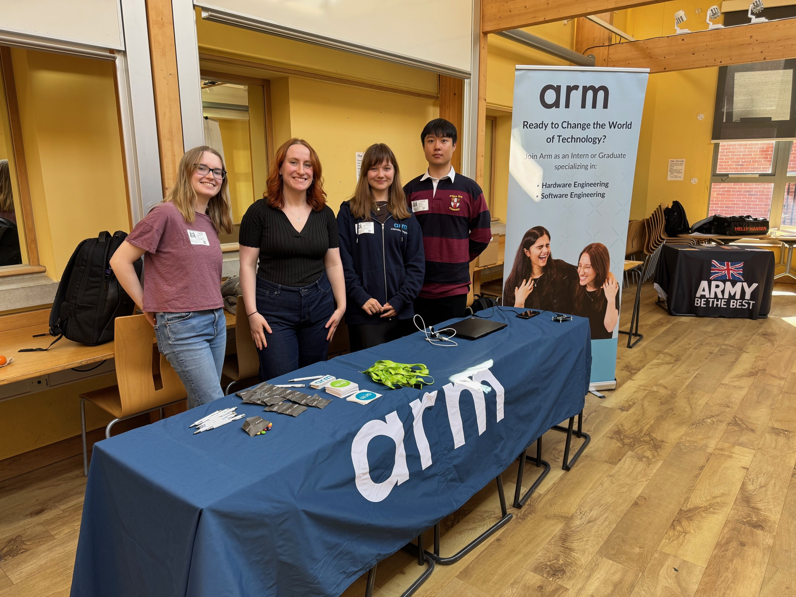

# Inspiring the Next Generation of Engineers at Hills Road Sixth Form

I recently had the opportunity to represent Arm at the Hills Road Sixth Form Employers Fair, where I engaged with enthusiastic students about the many exciting early-career opportunities we offer. From internships and apprenticeships to work experience placements, my goal was to highlight the variety of entry points into a career at Arm—and to showcase the innovative work that powers it all.

<!--more-->

## Bringing Arm Technology to Life

To give students a hands-on feel for what we do, I brought along several product demos illustrating how Arm's technology is shaping the future:

- **RAG Chatbot on Raspberry Pi 5**: Demonstrating natural language processing on a compact, accessible platform.
- **LLMs on Edge Devices**: Highlighting how powerful machine learning models can now operate at the edge, reducing latency and enhancing privacy.
- **IoT on Embedded Systems**: Showcasing real-time data processing in constrained environments, a cornerstone of many smart applications today.

Each demo served as a tangible example of Arm’s impact across a wide range of industries—from consumer tech to industrial automation.

## High Engagement, High Awareness

What stood out most during the event was the level of awareness and enthusiasm among the students. Many not only recognized Arm, but also understood its role in the broader tech ecosystem. Some memorable comments included:

> “You are the chip people, right?”  
> “Arm is really growing.”  
> “You power most of the modern tech.”

These interactions underscored how deeply embedded Arm is in today’s technology—and how well that’s resonating with the next generation.

## Looking Ahead

Engaging with curious, motivated students reminded me of the importance of outreach and visibility. It’s not just about promoting roles; it’s about sparking inspiration and showing young minds what’s possible in tech. I left the fair encouraged by the students' technical curiosity and excited for what the future holds—both for them and for Arm.
