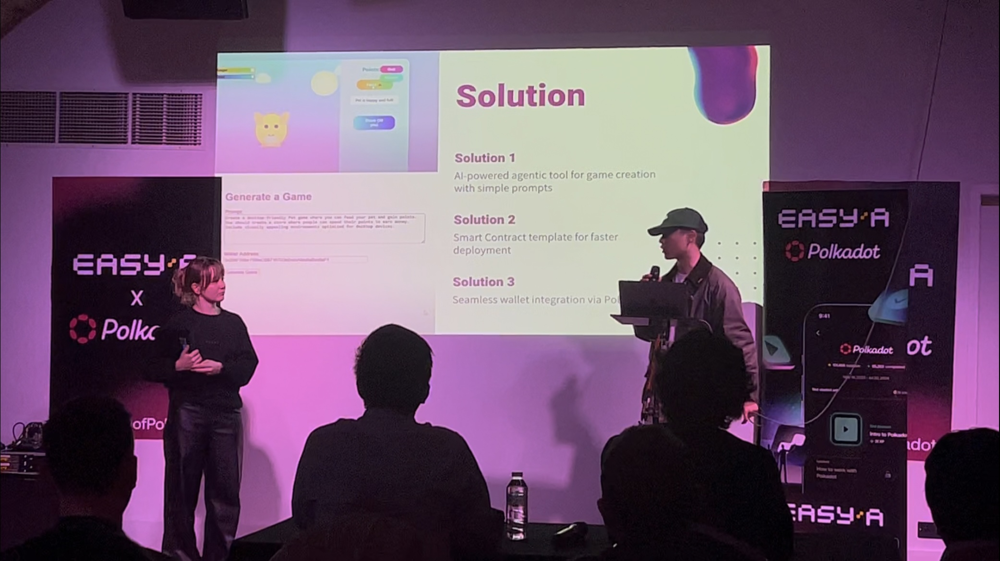

# Building a Blockchain Game Generator at the EasyA x Polkadot Hackathon

## Introduction

Last weekend, I had the opportunity to participate in the EasyA x Polkadot Hackathon in London—my first real foray into the world of blockchain development. While I came in with little prior experience in the field, the event turned out to be a transformative experience, both technically and personally. With the support of well-structured documentation and comprehensive learning resources provided by EasyA, I was able to dive into blockchain development headfirst.

<!--more-->

## Project Overview: Productivity Tool for Blockchain Game Developers

My teammate, Taisiia Nekrasova, and I set out to create a tool aimed at enhancing productivity for blockchain game developers. The result was an AI-powered agent capable of generating Play-to-Earn (P2E) games from a simple user prompt. This tool demonstrates how artificial intelligence can accelerate game development, making it more accessible and scalable.

The concept is simple: developers describe the type of game they want to build, and the AI agent handles the rest, producing a working prototype built on blockchain technology. We showcased our demo in a video available on our [GitHub repository](https://github.com/jc2409/Auto-P2E-GameGen).

## Demo Video

<iframe width="560" height="315" src="https://www.youtube.com/embed/MOzv6OnTuTk?si=5SO_lcMqUneIV215" title="YouTube video player" frameborder="0" allow="accelerometer; autoplay; clipboard-write; encrypted-media; gyroscope; picture-in-picture; web-share" referrerpolicy="strict-origin-when-cross-origin" allowfullscreen></iframe>

## Implementation Highlights

* **Tech Stack**: We used Polkadot's Substrate framework to build our blockchain components, leveraging its modular architecture.
* **AI Integration**: The AI agent was designed to interpret natural language prompts and translate them into game logic and smart contract structures.
* **Rapid Prototyping**: We prioritized fast iteration, using templates and pre-built components where possible to deliver a working MVP within the 48-hour timeframe.

## Challenges and Learning Curve

Working with blockchain technology for the first time came with its share of challenges. Understanding the structure of decentralized applications (dApps), writing smart contracts, and deploying them in a test environment were all new to me. Fortunately, the EasyA team provided excellent tutorials and examples that significantly flattened the learning curve.

## Beyond the Code: Personal Growth

One of the most rewarding aspects of the hackathon was connecting with peers who share an entrepreneurial spirit. It was incredibly inspiring to engage with young innovators and to receive guidance from mentors who have successfully built unicorn startups.

This environment encouraged me to refine not just my technical skills, but also my ability to pitch ideas and think strategically about product impact. Presenting our project to a large audience gave me valuable experience in articulating the value of a technical solution in an accessible way.

## Conclusion

The EasyA x Polkadot Hackathon was more than just a coding sprint; it was a gateway into a new domain of technology and a community of forward-thinking builders. I walked away with newfound skills in blockchain development, improved confidence in public speaking, and a deeper understanding of how innovation can be driven through collaboration.

Special thanks to Phil Kwok and Dom K. for organizing such an empowering event. I’m already looking forward to the next hackathon in the series and to continuing this journey of exploration and growth.
