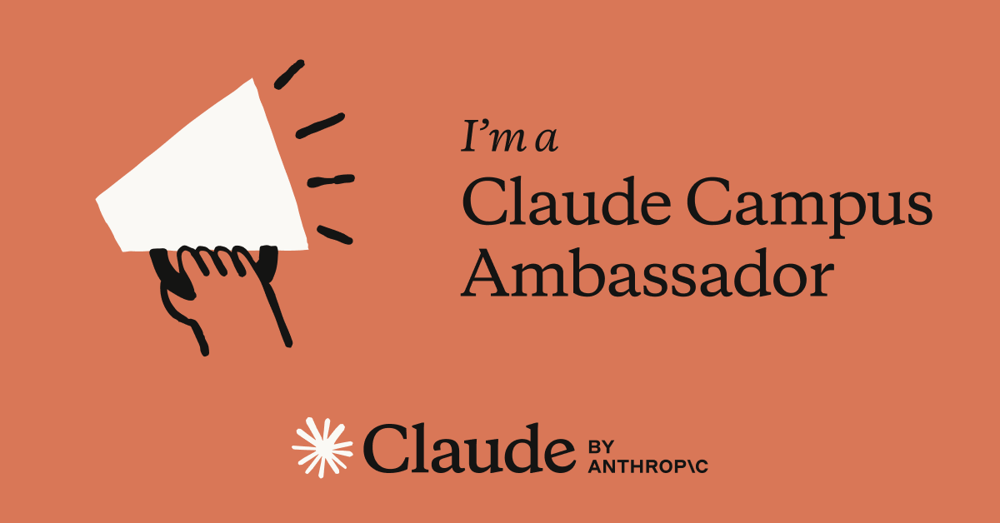

# Launching the Cambridge University AI Build Club 

I’m excited to share that I have been selected as an **Anthropic Claude Builder Ambassador for Fall 2025**. As part of this role, I have **founded and will be leading the Cambridge University AI Build Club (CUABC)** — a new student-led society dedicated to exploring the creative and practical possibilities of AI.  

To support the club, I also **designed and launched our official website**, which will serve as the hub for announcements, resources, and event updates.  

<!--more-->

## About the Cambridge University AI Build Club

CUABC is a community for students who want to **learn, build, and innovate with AI**. Our activities are designed to make AI exploration hands-on, collaborative, and impactful. Members can expect:  

- 🛠 **Workshops** – practical sessions to learn and apply AI tools.  
- ⚡ **Hackathons** – opportunities to prototype ideas in a collaborative environment.  
- 🤖 **Demos** – showcasing projects to inspire others.  
- 🌍 **Community projects** – contributing to open-source resources and initiatives.  

My role as **President and Lead Organiser** is to set the vision for CUABC, coordinate with Anthropic, and ensure that our community has the tools, events, and guidance it needs to thrive.

## Meet the Committee 👥

Alongside my leadership role, I’m joined by two amazing committee members:  

- **Andrew Choi – President & Lead Organiser**  
  Founder of CUABC, lead organiser of events, point of contact with Anthropic, and creator of the CUABC website and blog.  

- **Hanzhang Shen – Vice President & Tech Lead**  
  Oversees technical aspects of workshops, demos, and hackathons.  

- **Lauren Kwon – Secretary & Treasurer**  
  Manages finances, inquiries, and community engagement on Discord.  

## Explore the Website 🌐

I built the CUABC website to be our **central platform** for sharing updates, resources, and event details:  

👉 [Visit the CUABC Website](https://cambridge-ai-build-club.github.io/CUABC-Web/)  

You can also:  
- 📝 [Become a member here](https://docs.google.com/forms/d/e/1FAIpQLSfQHUvX3wfwsOjh8QccgevXW-bNf4osaYW-jXB2MRjiaHfvSQ/viewform?usp=sharing&ouid=114436783666251377569)  
- 💬 [Join our Discord community](https://discord.com/invite/geyYtMCcf5)  

The website has also been made **open source**, so other Claude Builder Clubs can adapt it for their own use:  
👉 [CUABC Website Repository](https://github.com/Cambridge-AI-Build-Club/CUABC-Web)  

## Get Involved 💡

If you’re interested in **building demos with LLMs** or would like to present your work at our events, I’d love to hear from you:  
📩 jc2409@cam.ac.uk  

## Looking Ahead 🚀

As the **Claude Builder Ambassador, CUABC founder, and lead organiser**, I’m eager to help foster a culture of curiosity and innovation at Cambridge.  

This club is more than just a society — it’s a space for students to **push the boundaries of AI**, share ideas, and build meaningful projects together.  

Stay tuned for our upcoming workshops, demos, and our first hackathon. This is only the beginning!  

*I’m proud to be starting this journey, and I look forward to seeing what the Cambridge community will create with CUABC.*  
