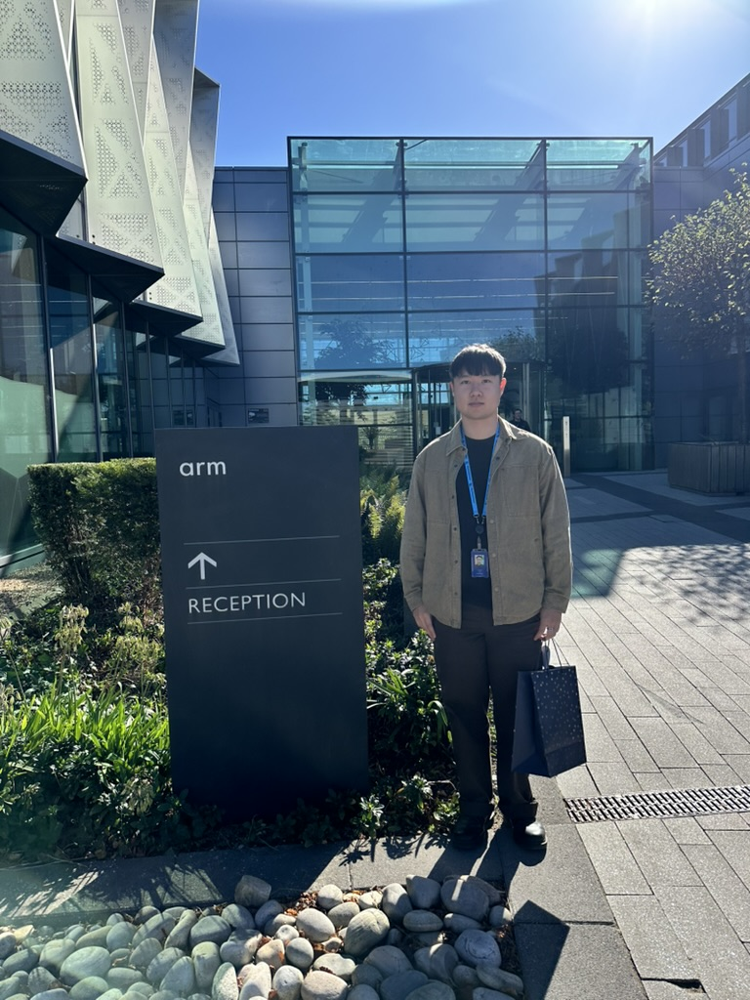
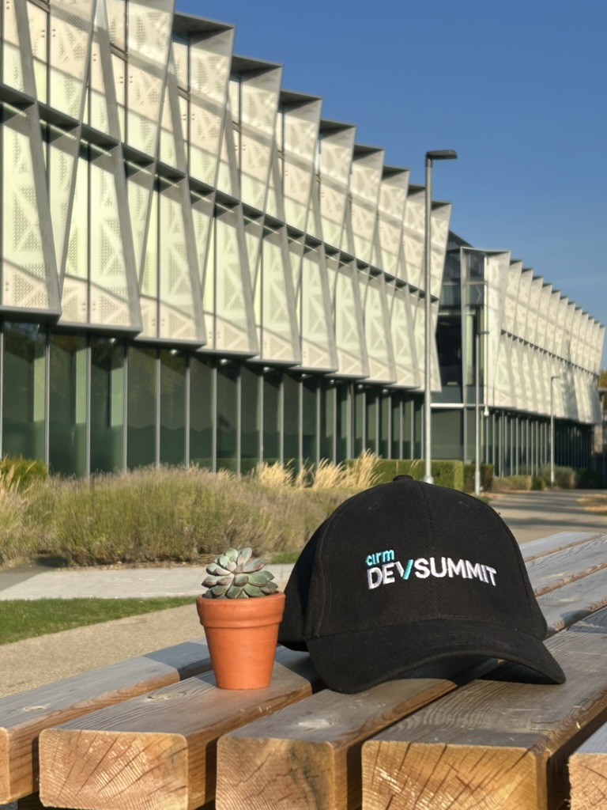

# My 15-Month Internship at Arm: Research, Education, and AI

Over the past 15 months, I had the opportunity to work as an intern at **Arm**, contributing to projects that spanned embedded systems, AI-driven tools, process automation, web development, and community engagement. This experience not only allowed me to sharpen my technical skills but also gave me a deeper appreciation for collaboration, knowledge-sharing, and the impact of education in technology.

<!--more-->

## Embedded Systems and Course Migrations

One of my key responsibilities was modernizing Arm’s **embedded systems educational content**:

- **Migrating Mbed-based labs** into MakeCode and the micro:bit Python Editor.  
- Creating **step-by-step lab videos** and collaborating with subject matter experts (SMEs) on lab scripts.  
- Publishing source code under the **Arm-University GitHub organization**.  

I also gained practical experience in **register-level programming** using Embedded C, implementing **device drivers** for peripherals such as UART, I²C, and SPI.  

For the IoT-focused course modules, I:  

- Replaced deprecated Google Cloud services with **MQTT protocol** for cloud communication.  
- Proposed and set up **AWS EC2** as the host server for the MQTT broker.  
- Redesigned labs using **STM32CubeMX libraries** for modular integration.  

Additionally, I updated **Digital Signal Processing EdKits**, ensuring compatibility with the latest Arm Compiler and simplifying lab exercises for better learner experience.

---

## AI-Driven Tools

During the internship, I explored how AI can enhance education:

- **EduLabs Chatbot** – implemented a Retrieval-Augmented Generation (RAG) chatbot using Azure AI Studio, complete with system prompts and guardrails.  
- **Learning Path Assistant** – developed a tool to convert teaching materials into structured Markdown-based learning paths. Features included:  
  - An inline editor for customization.  
  - Preview via Hugo, hosted on AWS.  
  - A regeneration workflow for continuous improvement.  

These projects demonstrated how AI can be used responsibly to **improve accessibility and efficiency** in educational content creation.

---

## Process Automation

I also focused on **automating workflows** to save time and reduce manual overhead. For example:  

- Redesigned the **Arm Academic Access annual report tracker** for clarity.  
- Wrote Python scripts to **auto-update due dates** and **send reminder emails** through Outlook.  

These efforts streamlined reporting processes and made recurring tasks far more efficient.

---

## Web Development

To support developers and educators, I built the **Developer Labs website** using Jekyll and GitHub Pages:  

- Customized themes to include features like **partner carousels, search, and filtering**.  
- Automated conversion of Markdown files into Jekyll format.  
- Created a **file validation tool** and integrated **GitHub Actions** for CI/CD workflows.  

This ensured reliable deployments and a smooth user experience for those accessing the labs.

---

## Community Engagement

Outside of development work, I enjoyed **engaging with the community** through teaching, mentoring, and events:  

- Authored **two new learning paths**: *AI Agent on Arm* and *MCP Server on Arm*.  
- Volunteered at workshops, hackathons, and competitions, including:  
  - **Uptree Workshop Sessions** – Micro:Pet training.  
  - **FIRST Robotics Competitions** – Lead and Field Technical Advisor roles.  
  - **Hackathon at Arm HQ** – organized a 32-hour event with the theme *AI on Arm with Raspberry Pi*.  
  - Outreach at schools and colleges with interactive demos and workshops.  

These experiences helped me grow as both a **technical educator** and a **team contributor**.

---

## Looking Ahead

My journey doesn’t stop here. After completing this internship, I will:  

- Undertake a **Winter Research Internship** at Pusan National University, focusing on **Arm Confidential Computer Architecture and hardware security**.  
- Return to Arm as a **Summer Intern with the ATG team (Architecture and Technology Group)**.  

I also continue to share updates and projects on my [personal website](https://jc2409.github.io/Andrew-Choi-Portfolio/).

---

## Reflections

This internship has been transformative in several ways:  

- I deepened my technical expertise in **embedded systems, AI tools, and automation**.  
- I learned to balance **individual contributions with collaboration**, especially when working with SMEs, educators, and cross-functional teams.  
- Perhaps most importantly, I discovered how technology and education intersect to empower communities.  

I’m excited to keep building on these foundations as I move forward in my career as a software engineer.

---

*I am deeply grateful to everyone at Arm who guided me throughout this journey. The skills, experiences, and mentorship I gained will stay with me for years to come. A special thanks goes to the Arm Education team for offering me diverse opportunities, and to Taya, my colleague and friend, for her constant support and encouragement. I also want to thank my amazing girlfriend, Jenny, for always standing by my side and believing in me. This year has been truly incredible, and I look forward to continuing my journey and growing as a software engineer.*