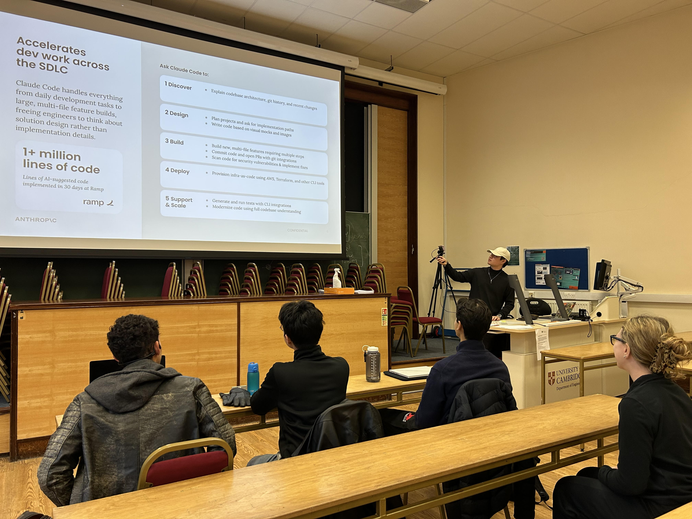
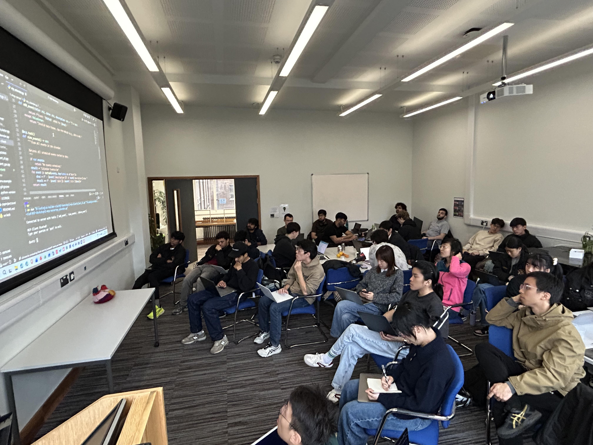
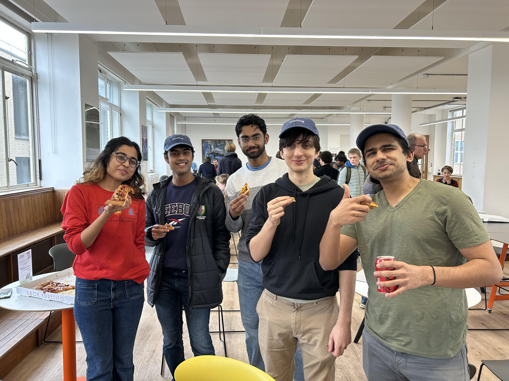
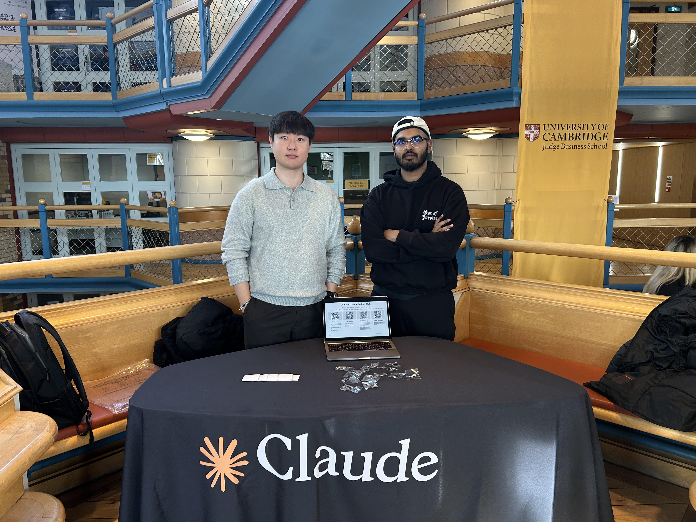

# From Cambridge Labs to Real-World AI: Reflections on Being a Claude Ambassador

When I first became a Claude Ambassador at the University of Cambridge, I had one goal: make cutting-edge AI tools feel accessible to everyone — not just Computer Scientists.

Over the past two terms, I’ve had the privilege of turning that ambition into reality.

350+ sign-ups. 10+ workshops. 2 hackathons. Countless “aha” moments.

From the moment we launched the programme in Michaelmas term, the response was overwhelming. More than 350 students, researchers, and builders signed up — a clear signal that the Cambridge community was eager to learn, experiment, and create with AI in a meaningful way.

<!--more-->

## What We Built Together

Across the year, we ran workshops covering some of the most exciting frontier topics in AI today: AI Agents, the Model Context Protocol (MCP), building MCP applications, and hands-on sessions with Claude Code.

These weren’t passive lectures. They were highly practical, collaborative sessions focused on building real systems and understanding how modern AI tools can be applied beyond theory.

But the hackathons were where the energy truly came alive.

In our first hackathon, participants explored what it means to build with Claude AI Agents — and the projects were genuinely impressive. In the second, teams were challenged to build complete end-to-end products with real social impact in just 8 hours. The creativity, technical depth, and execution exceeded every expectation I had.

## The Moment That Stayed With Me

The most meaningful part of this experience wasn’t a polished demo or a winning project. It was seeing who showed up and what they were able to create.

A 9-year-old built their own application using Claude Code.

A humanities student with no formal Computer Science background built and deployed their own game using AI.

That’s the promise of this technology. The barrier to building is no longer a CS degree — it’s curiosity, creativity, and access to the right tools.

## What’s Next

While my contract with Anthropic is coming to a close, my relationship with Claude and the Cambridge AI community certainly is not. I’ll continue building, learning, and helping more people discover what’s possible with AI.

I’m also excited to share that I’ll be joining as an Arm Ambassador, where I’ll be exploring how hardware accelerates AI development and championing Arm’s work on energy-efficient computing in the data centre race.

As AI scales, the conversation around the silicon powering these systems becomes more important than ever. I’m excited to help bridge those worlds: software and hardware, models and chips, Cambridge and the broader global AI ecosystem.

If you’re building at the intersection of AI and hardware — or you’re a student, researcher, or developer interested in working with Claude — let’s connect.

The best is yet to come.

