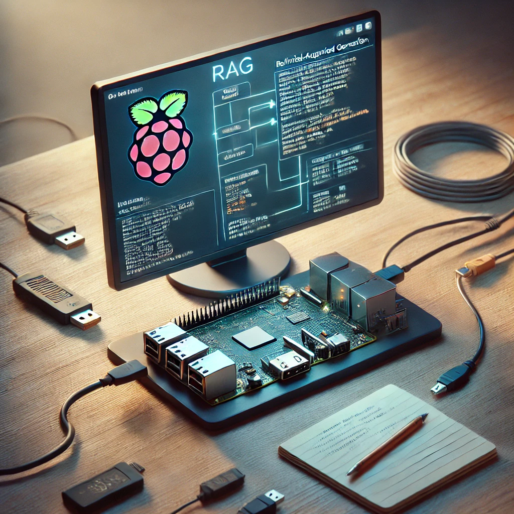
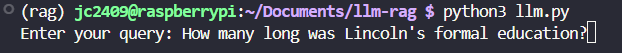
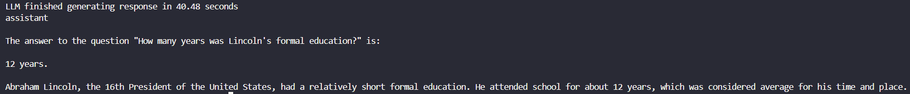
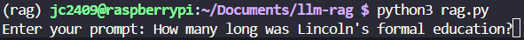
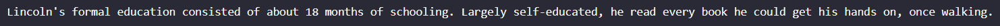
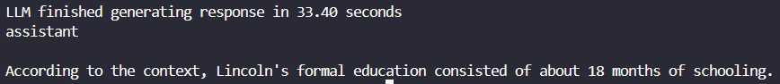

# Building a RAG-Enabled Chatbot on Raspberry Pi 5

## Introduction

Retrieval Augmented Generation (RAG) is a compelling approach that combines the generative capabilities of Large Language Models (LLMs) with contextual data fetched from external sources. By retrieving relevant information from a knowledge base at runtime, RAG enhances the accuracy and relevance of chatbot responses.

In this project, I set out to build and deploy a RAG-enabled chatbot on a Raspberry Pi 5. Leveraging optimized open-source tools such as `llama-cpp-python` and FAISS, the chatbot delivers meaningful, context-aware responses using the Llama-3.1-8B model. The aim was to achieve high-performance inference on constrained hardware using efficient model quantization and Arm-specific optimizations.

<!--more-->



## Project Overview

The solution architecture involves embedding documents into vector representations and storing them in a Vector Database (VectorDB). Upon user query, the system retrieves relevant document embeddings to provide contextual grounding to the LLM, enabling more precise responses.

This walkthrough is tailored for Raspberry Pi 5 (8GB RAM, 32GB+ disk), using the following tools:

* **llama-cpp-python** for LLM inference
* **FAISS** for vector similarity search
* **Llama-3.1-8B** model (quantized for edge deployment)

## Installation and Setup

### System Requirements

Install system dependencies:

```bash
sudo apt update
sudo apt install python3-pip python3-venv cmake -y
```

### Python Environment

Set up and activate a virtual environment:

```bash
python3 -m venv rag-env
source rag-env/bin/activate
pip install -r requirements.txt
```

### llama-cpp-python

Install the version optimized for Arm CPUs:

```bash
pip install llama-cpp-python --extra-index-url https://abetlen.github.io/llama-cpp-python/whl/cpu
```

## Model Deployment

### Model Download

Create a `models` directory and download the quantized model:

```bash
mkdir models && cd models
wget https://huggingface.co/chatpdflocal/llama3.1-8b-gguf/resolve/main/ggml-model-Q4_K_M.gguf
```

### Build and Quantize Llama.cpp

Clone and build the `llama.cpp` project:

```bash
git clone https://github.com/ggerganov/llama.cpp
cd llama.cpp && mkdir build && cd build
cmake .. -DCMAKE_CXX_FLAGS="-mcpu=native" -DCMAKE_C_FLAGS="-mcpu=native" -DLLAMA_CURL=OFF
cmake --build . -v --config Release -j $(nproc)
```

Quantize the model:

```bash
cd bin
./llama-quantize --allow-requantize ~/RAG_Raspberry_Pi5/models/ggml-model-Q4_K_M.gguf ~/RAG_Raspberry_Pi5/models/llama3.1-8b-instruct.Q4_0_arm.gguf Q4_0
```

## Running the Chatbot

### Basic Inference Test

Test LLM inference:

```bash
source rag-env/bin/activate
python llm.py
```

### RAG Pipeline

1. **Import Dataset:**
   Ensure Kaggle API access is configured, then import data:

   ```bash
   python import_data.py
   ```

2. **Vector Embedding:**
   Embed documents for retrieval:

   ```bash
   python vector_embedding.py
   ```

   > Note: This step can take several hours depending on dataset size and Pi performance.

3. **Launch Chatbot:**

   ```bash
   python rag.py
   ```

## Evaluation

We evaluated the chatbot using both standard and RAG-enabled modes. A clear improvement in contextual accuracy was observed when using RAG.

**Example Query:**

> "How long was Lincoln's formal education?"

* **Without RAG:**
  
  

* **With RAG:**
  
  
  

The RAG-enhanced chatbot retrieved historical data from the VectorDB and generated an accurate response, significantly outperforming the standalone LLM.

## Reflections

Deploying a RAG-enabled chatbot on Raspberry Pi showcases the potential of edge AI solutions. Despite hardware limitations, model quantization and efficient libraries allowed for practical inference and contextual reasoning. Key takeaways include:

* Importance of hardware-aware optimization
* Trade-offs in embedding time vs. model performance
* Value of accurate, context-driven response generation

## Conclusion

This project demonstrates that even resource-constrained devices like Raspberry Pi 5 can host sophisticated AI applications when paired with the right tools and techniques. Building a RAG-enabled chatbot not only enhanced my understanding of vector databases and LLMs but also highlighted the practical considerations for deploying AI on the edge.

You can find the source code and contribute on [GitHub](https://github.com/jc2409/RAG_Raspberry_Pi5).