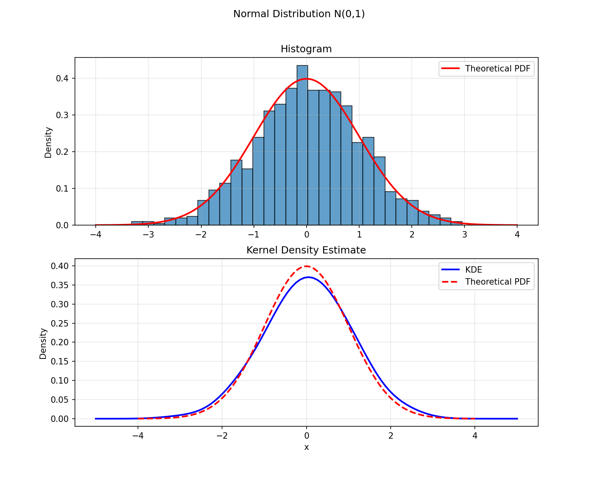
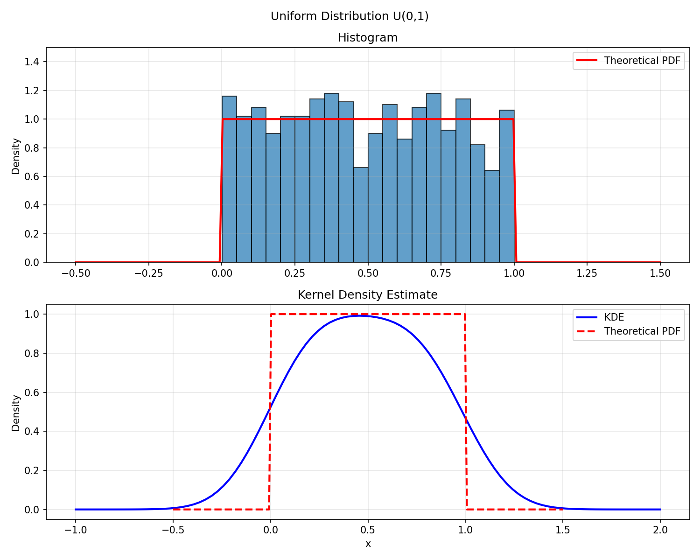
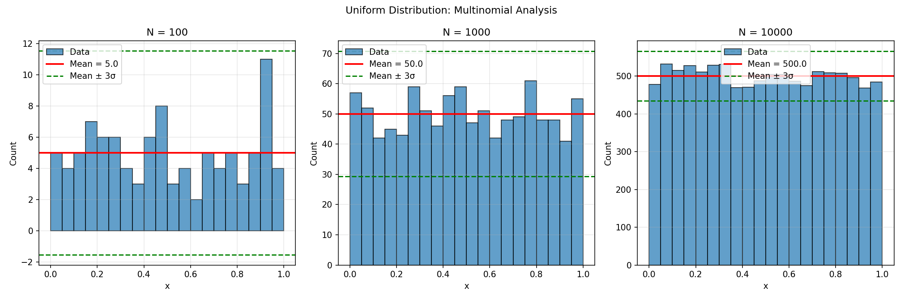
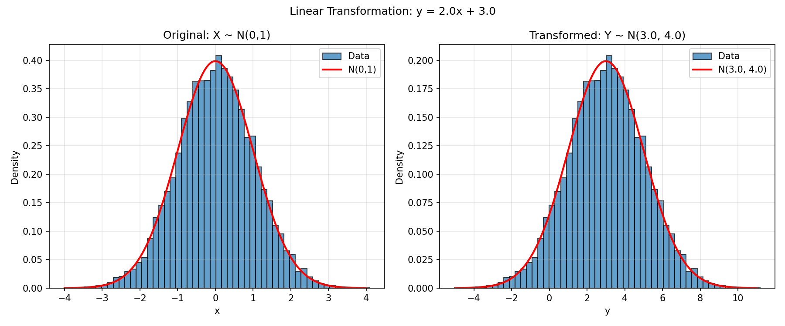
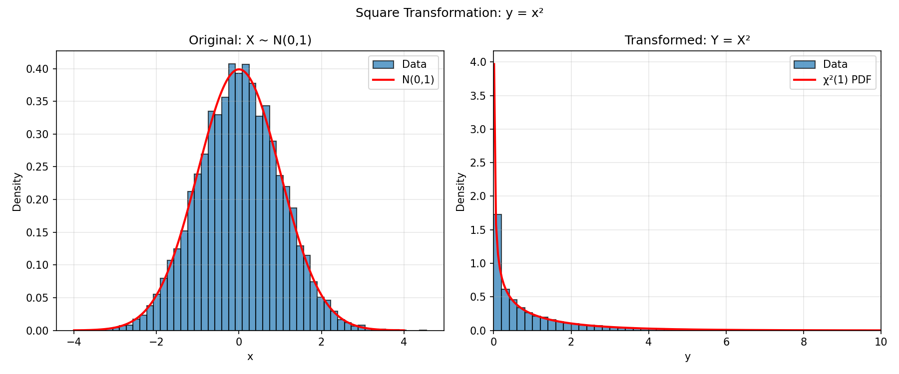
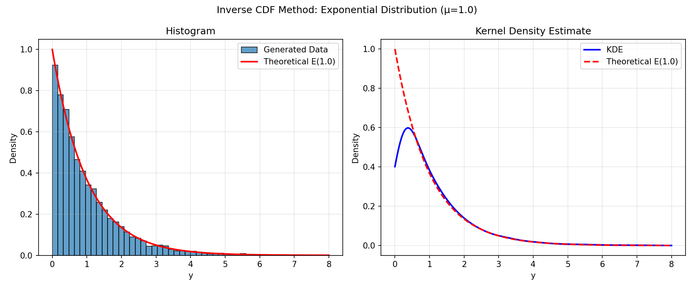
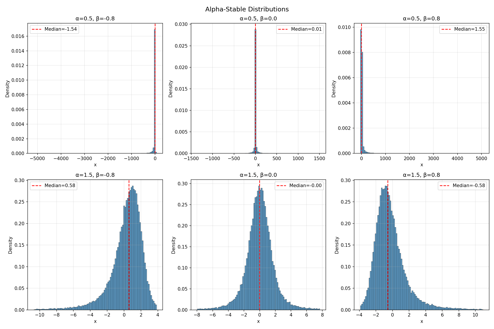

# Generating Random Numbers from Scratch: From Uniforms to Heavy Tails

## Introduction

Most of the time, when I need a random number from a particular distribution, I call `np.random.normal()` and move on. But "where do these samples actually come from?" is one of those questions that keeps coming back. Behind every one-line library call is a chain of transformations starting from a single primitive — a uniform random number on [0, 1] — and ending with a sample from something far less obvious, like a heavy-tailed distribution that doesn't even have a finite variance.

This project was a tour through that chain. I started by checking that the basics actually work (do samples from `np.random.normal()` really look Gaussian?), then built up the sampling toolkit piece by piece: the Jacobian formula for transforming densities, the inverse-CDF method, and finally the Chambers–Mallows–Stuck algorithm for alpha-stable distributions, which have no closed-form PDF at all.

<!--more-->

## Visualising what a sampler produces

The first task was simple: generate 1,000 samples from N(0, 1) and U(0, 1), then check the empirical distributions against the theoretical PDFs.





For the Gaussian, both the histogram and the kernel density estimate (KDE) sit neatly on the theoretical curve. For the uniform, the histogram is fine — but the KDE is interesting. It smooths the sharp edges of the PDF into rounded shoulders that bleed support out beyond the true domain. KDEs assume the underlying density is smooth, and when it isn't, the kernel smears probability mass into regions where the true PDF is zero. Histograms are dumb but honest; KDEs are smooth but opinionated.

## How quickly does the histogram converge?

The next question was quantitative: how fast does an empirical histogram converge to the true PDF as you increase the sample size?

For *N* uniform samples in *J* equal-width bins, the count *nⱼ* in bin *j* follows a multinomial distribution. The marginal statistics for each bin are:

$$\mathbb{E}[n_j] = \frac{N}{J}, \quad \text{Var}(n_j) = \frac{N}{J}\left(1 - \frac{1}{J}\right), \quad \sigma_j \approx \sqrt{\frac{N}{J}}$$

The key point is the ratio of fluctuation to signal: σⱼ / (N/J) ∝ 1/√N. So the *relative* error decreases as 1/√N — the slow, unglamorous convergence rate that shows up everywhere in Monte Carlo.



You can see this scaling clearly. At *N* = 100, the bin counts scatter wildly. At *N* = 10,000, the histogram is visibly close to flat, with all bins comfortably inside the ±3σ envelope. This is a useful sanity check for any sampler: if bin counts consistently sit outside the ±3σ band, your generator isn't producing what it claims to.

## Transformations and the Jacobian formula

Once you have a uniform or Gaussian generator, you can construct samples from many other distributions by applying transformations. The change-of-variables rule says: if *Y = f(X)* and *f* is monotonic with inverse *f⁻¹*, then

$$p_Y(y) = \frac{p_X(f^{-1}(y))}{\left|f'(f^{-1}(y))\right|}$$

The linear case is straightforward. For *Y = aX + b* with *X ~ N(0, 1)*, the formula gives *Y ~ N(b, a²)* — the well-known result that affine transformations of Gaussians are Gaussian. Setting *a = 2, b = 3* confirms this exactly:



The more interesting case is *Y = X²*. Squaring isn't one-to-one — both *x* and *-x* map to the same *y* — so the formula needs to sum over both preimages. After a bit of algebra:

$$p_Y(y) = \frac{1}{\sqrt{2\pi y}} \exp\left(-\frac{y}{2}\right), \quad y > 0$$

This is the χ²(1) distribution. The empirical histogram matches it perfectly:



You get a non-trivial heavy-tailed distribution — the χ²(1) PDF diverges at the origin — just by squaring Gaussians.

## Inverse CDF sampling

The Jacobian approach is great if you already have a useful starting distribution, but it doesn't tell you how to *target* a specific distribution. The inverse CDF method does. The trick is:

1. Compute the CDF *F(y)* of your target distribution.
2. Invert it to get *F⁻¹(u)*.
3. Sample *u ~ U(0, 1)*, then return *y = F⁻¹(u)*.

For the exponential distribution with mean *μ*, the CDF is *F(y) = 1 − e^(−y/μ)*, which inverts cleanly to *y = −μ ln(1 − u)*. Since *1 − u* and *u* are both uniform on [0, 1], you can simplify to:

```python
def exponential_inverse_cdf(u, mu=1.0):
    return -mu * np.log(u)

u = np.random.rand(10_000)
y = exponential_inverse_cdf(u, mu=1.0)
```

That's the whole generator. Three lines, no library call to `np.random.exponential`, and the output matches the theoretical PDF:



Notice that the KDE drops below the theoretical PDF near *y = 0*. That's the same boundary effect from earlier — the exponential PDF has a sharp edge at zero, and the KDE smooths it out. The histogram, with its blunter machinery, captures the boundary correctly.

## When the CDF isn't invertible: alpha-stable distributions

The methods above all rely on either knowing the CDF in closed form or having a useful base distribution. Some distributions don't cooperate. Alpha-stable distributions — a family that generalises the Gaussian and includes the Cauchy distribution as a special case — have no closed-form PDF or CDF in general. They're characterised entirely by their *characteristic function*.

You can still sample from them with a specialised algorithm. The Chambers–Mallows–Stuck method generates an alpha-stable sample from one uniform variate *U ~ U(−π/2, π/2)* and one exponential variate *V ~ Exp(1)*:

```python
def generate_alpha_stable(N, alpha, beta):
    b = (1 / alpha) * np.arctan(beta * np.tan(np.pi * alpha / 2))
    s = (1 + beta**2 * np.tan(np.pi * alpha / 2)**2) ** (1 / (2 * alpha))

    U = np.random.uniform(-np.pi/2, np.pi/2, N)
    V = np.random.exponential(scale=1.0, size=N)

    return s * (np.sin(alpha * (U + b)) / np.cos(U)**(1/alpha)) \
             * (np.cos(U - alpha * (U + b)) / V) ** ((1 - alpha) / alpha)
```

The distribution has two key parameters: *α* ∈ (0, 2) controls tail heaviness (smaller is heavier; *α* = 2 recovers the Gaussian), and *β* ∈ [−1, 1] controls skew.



Look at the x-axis scales. For *α* = 0.5 (top row), samples in the **central 98% of the distribution** range over thousands of units. For *α* = 1.5 (bottom row), the same 98% sits within roughly ±10. The first row has tails so heavy that the variance is literally infinite — no matter how many samples you draw, the empirical variance never converges. Seeing it histogram-rendered makes it visceral in a way the theory alone doesn't.

## Reflections

A few things stuck with me from this project.

**Estimators have personalities.** Histograms are honest but blocky; KDEs are smooth but assume things that aren't always true. Neither is "better" — they're tools with different failure modes. I came in vaguely thinking KDEs were just "better histograms" and left with a more nuanced view: at sharp boundaries, the histogram tells the truth and the KDE invents geometry.

**Some distributions break your default assumptions.** The α = 0.5 alpha-stable plot is genuinely unsettling — it doesn't look like a distribution, it looks like a single bar at zero with scattered outliers thousands of units away. But it *is* a distribution, with a perfectly well-defined PDF, just one whose moments don't exist. Working with these directly is a good vaccination against assuming "well-behaved" is the default.
