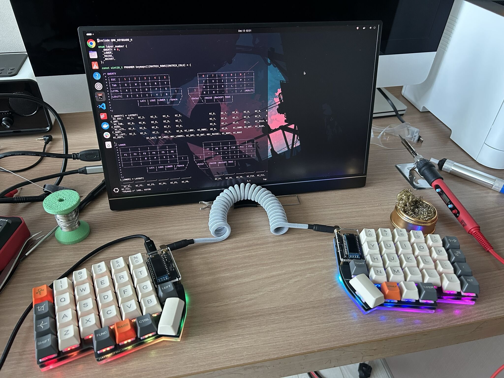
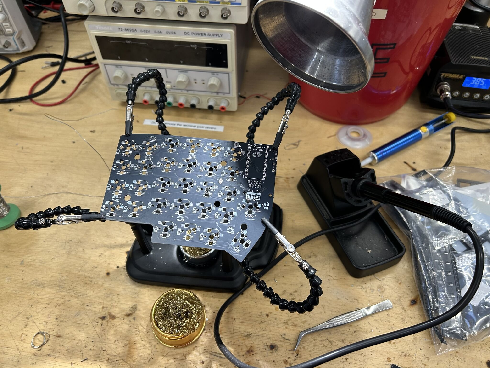
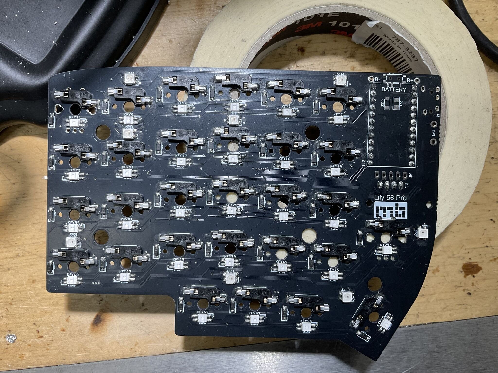
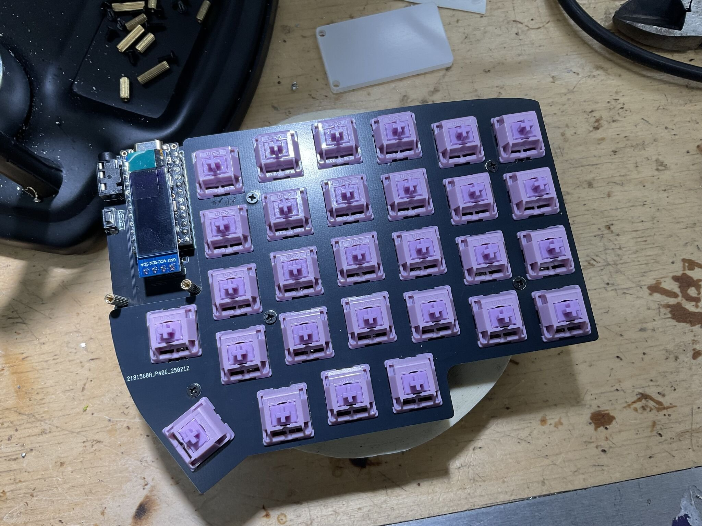

# Building a Lily58 From Scratch

## Introduction

I've spent years typing on keyboards I didn't really understand. Every laptop, every cheap office board, every "mechanical gaming" keyboard from a big-box retailer — somewhere underneath the chassis was a PCB, a switch matrix, and a microcontroller doing things I'd never thought about. So when I decided I wanted a split ergonomic keyboard, I made a slightly more ambitious decision than I realised at the time: I'd build one from scratch.

The target was a [Lily58 Pro](https://github.com/kata0510/Lily58) — a popular open-source 58-key split design. Open-source meaning the PCB files, BOM, and firmware are all freely available; I just had to source the parts, solder it together, and bring it up. How hard could it be?

Harder than expected. The build itself was the fun part. The debug was where I actually learned something.

<!--more-->

## Sourcing and assembly

The bill of materials is roughly: two PCBs (one per half), 58 Kailh hot-swap sockets, 58 MX-style switches, 58 SMD diodes for matrix de-ghosting, 58 per-switch RGB LEDs, an OLED display per side, a TRRS jack for the inter-half cable, and two Pro Micro microcontrollers (ATmega32U4 — the boards that have powered most QMK builds for years). I ordered each component separately rather than buying a kit, partly to save cost and partly to force myself to actually understand what every part was doing.

Assembly is a long sequence of small, repetitive operations. Solder the diodes — all 58, surface-mount, with correct orientation (the cathode bar is a tiny line on a 1.6 mm package, and reading it wrong is easier than you'd think). Solder the hot-swap sockets. Solder the per-switch LEDs, little four-pad SMD packages with a notched corner that's marked but easy to misread under a desk lamp. Solder the OLED headers, the TRRS jack, the Pro Micro headers, the reset switch.

Snap the switches into the hot-swap sockets — at this point the PCB starts to look like a keyboard rather than a circuit board.

Plug the cable in. Flash the firmware. Plug it into the computer, hope, and start typing into a text editor to see what happens.

## First boot: a partial disaster

What happened was that whole rows of keys didn't register at all. The left half worked roughly. The right half had entire columns dead. Some of the per-switch LEDs lit up; others sat there dark and embarrassed. The OLED showed nothing on one side.

This is the moment where you discover whether you actually want to be doing this.

A keyboard matrix is conceptually simple: every key is a switch in series with a diode, wired between one row and one column. The microcontroller scans by driving each row high in turn and reading which columns go high in response. The diode is there to prevent backflow when multiple keys are pressed simultaneously — without it, a three-key chord can register as a fourth phantom key ("ghosting"). The whole system works if and only if *every* diode and *every* solder joint is doing its job.

So when an entire row is dead, you've got a small number of possible causes:

1. A broken trace between the controller and that row pin
2. A cold joint on the row's pin header at the Pro Micro
3. A short to ground or to an adjacent row
4. All the diodes in that row are dead or wrong-oriented

That's the kind of fault tree where the multimeter earns its keep.

## Debugging by continuity

I put the multimeter in continuity mode (the one that beeps when the probes touch a complete circuit) and started walking the matrix. The protocol was:

1. With the keyboard unplugged, press a switch.
2. Probe from the row pin on the Pro Micro header to the column pin.
3. The meter should beep — circuit complete through the closed switch and the diode.

For about three-quarters of the keys it did. For the rest it either didn't beep at all, or beeped in both directions — which is its own bad sign. A diode is supposed to be polarised: it passes current one way and blocks it the other. If you get continuity in both directions, the diode isn't doing its job, which usually means it's not actually connected at all.

The faults I found, in rough order of frequency:

- **Cold solder joints on the SMD diodes.** A handful had the appearance of a good joint but no actual electrical contact — surface tension on a small package can pull the diode up off one pad while still looking shiny from above. Reflowing them with fresh flux let the solder pull in properly.
- **Per-switch LEDs soldered backwards.** This was the most painful category. The LEDs have four pads with a notched corner indicating orientation, and I'd misread the silk on a chunk of them while working under bad lighting. They're not destructive when wired backwards — they just don't light up, and worse, they break the data chain to every LED *after* them. The fix is desoldering and rotating them, which on a surface-mount four-pad package is fiddly enough to be its own punishment.
- **A few of the underglow LEDs in the same boat.** Same root cause, same fix, same self-inflicted feeling.

After about three evenings of work, all 58 keys registered cleanly, every LED lit, both OLEDs woke up, and the two halves were talking to each other over TRRS.

## QMK and the bongo cat

The reward for finishing the hardware was getting to play with QMK, the open-source firmware that powers most custom keyboards. QMK quietly does an enormous amount: keymap definitions, layer switching, tap-dance, combos, RGB animations, OLED rendering, all compiled down to ATmega32U4 binaries.

I set up four layers — `_QWERTY` for normal typing, `_LOWER` for function keys and symbols, `_RAISE` for navigation and numpad, and `_ADJUST` for system controls and RGB settings — accessed by holding the orange `LOWER` and `RAISE` thumb keys visible in the photo at the top. The fun part, though, was the OLED. The right-hand display runs a [bongo cat](https://en.wikipedia.org/wiki/Bongo_Cat) animation driven by my typing speed: under a WPM threshold the cat sits still, and once I cross it the cat starts tapping along. It's pointless. It's also genuinely delightful, and every time I look down at it I'm reminded that I built the thing it's running on.

## Reflections

A few things I'll keep from this.

**Slow is fast.** The single biggest lesson was that the time I "saved" by working through component placement quickly was paid back at roughly 5× during debugging. Soldering a diode backwards takes one second to do and ten minutes to undo. A misoriented SMD LED costs even more. The build process is one of those domains where careful work up front isn't a virtue, it's an efficiency strategy.

**You can't debug what you don't understand.** I could only walk the matrix with a multimeter because I understood — at least roughly — what the matrix was, what the diodes were for, and what the microcontroller was scanning. If I'd treated the PCB as a magic box, I'd have been stuck. The forced learning that came from sourcing parts individually (rather than buying a kit) ended up being the thing that made the debugging tractable.

**Open-source hardware is a remarkable category.** The Lily58 exists because someone designed it, published the files, and let anyone build on top. The fact that I could pull a working schematic, a working PCB layout, and a working firmware base off GitHub — and end up with a keyboard tailored to my hands and habits — feels like one of those rare bits of computing that has only gotten more accessible over time.

The next thing I want to try is something a bit more ambitious: designing my own layout from scratch in KiCad. Probably with fewer wrong-way LEDs this time.

---

*Lily58 Pro PCB design by [@kata0510](https://github.com/kata0510/Lily58). Firmware customisations built on [QMK](https://qmk.fm/).*