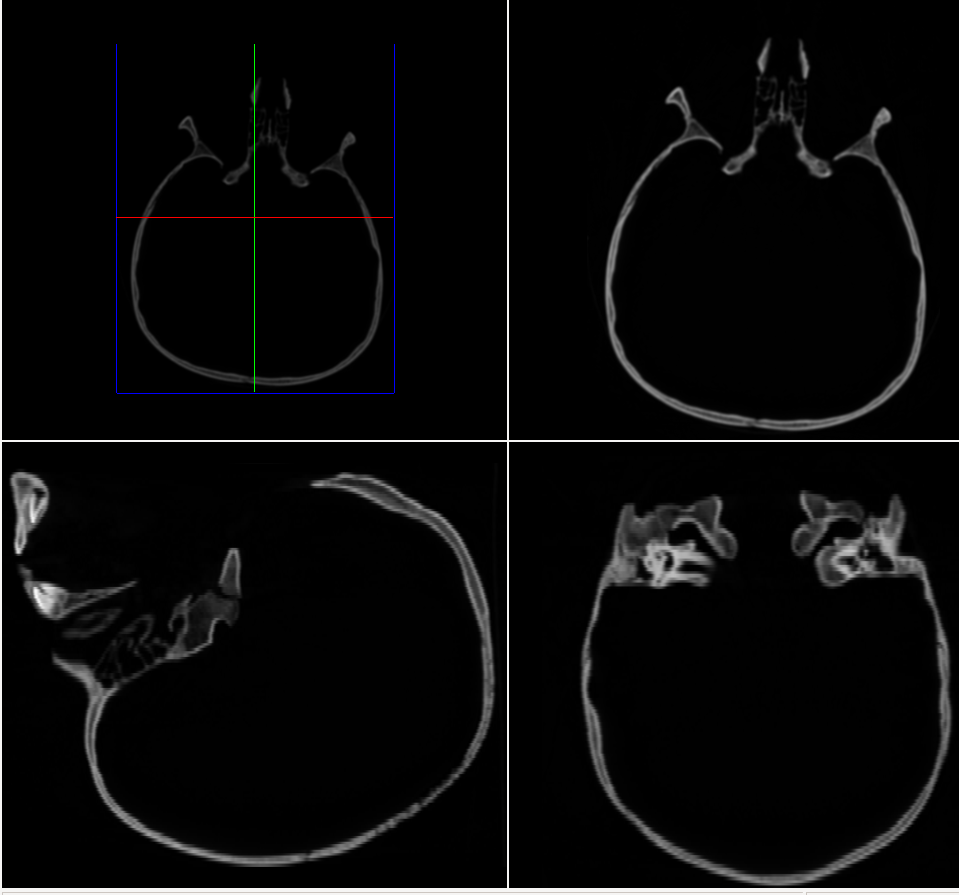
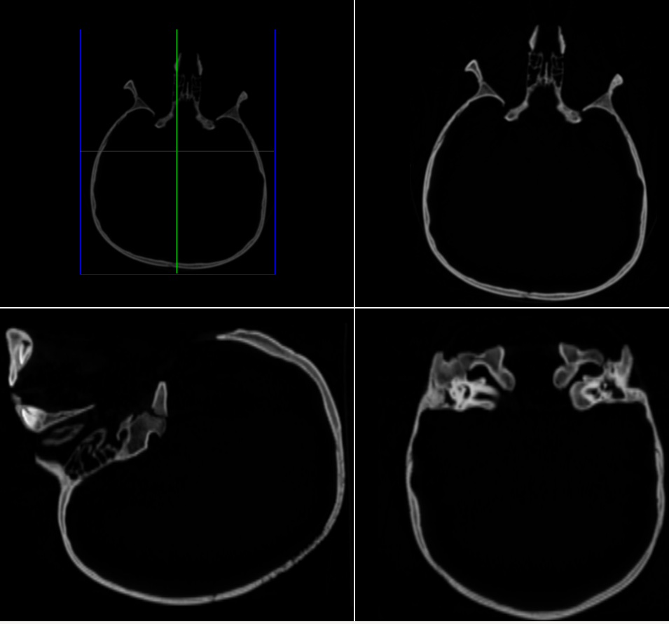

# Slicing Skulls and Counting Triangles: A Volumetric Rendering Pipeline in C++ and Vulkan

## Introduction

Medical imaging is one of the rare domains where you can hold a 3D array of numbers in memory and reasonably call it a person. A CT volume is a stack of 2D slices, each one a thin cross-section captured at a different depth. The engineering question is what to do with it: how do you turn millions of voxels into something a clinician can see, navigate, and trust?

This project was a build-from-scratch volumetric viewer in C++ with Vulkan, working with a real CT dataset of a human skull. It covered three pieces of the pipeline: arbitrary 2D reslicing, surface extraction via marching cubes, and a real-time shader path with fly-through navigation. Each part had its own surprise — usually about how much the *geometry* of the data dictates what you can do with it.

<!--more-->

## Reslicing anisotropic data

CT scanners capture data in stacks of axial slices. The within-slice resolution (0.05 cm per pixel) is much finer than the inter-slice spacing (Δz ≈ 2.44 voxel units, about 50× coarser). This is *anisotropic* data, and it matters the moment you try to view it from any angle the scanner didn't natively capture.

The first task was nearest-neighbour reslicing in the XZ and YZ planes. The naïve approach maps each pixel of the reslice image to the nearest stored voxel:

```cpp
for (z = 0; z < VOLUME_DEPTH; z++) {
    nearest_slice = round(z / DELTA_Z);
    data_index = nearest_slice * VOLUME_WIDTH * VOLUME_HEIGHT
               + (int)round(y_reslice_position) * VOLUME_WIDTH;

    for (x = 0; x < VOLUME_WIDTH; x++) {
        texture_store.xz_rgba[reslice_index++] = MapItoR[data[data_index]];
        // ...G, B, A
        data_index++;
    }
}
```

This works, but the result has prominent horizontal banding:



The cause is direct: with Δz ≈ 2.44, each acquired slice gets "held" for roughly 2–3 rows in the reslice image before the index jumps to the next slice. The staircase pattern is most visible in soft-tissue regions where intensity changes gradually.

Switching to linear interpolation — blending the two bracketing slices in proportion to fractional z-distance — eliminates the banding:



The trade-off is mild blurring of sharp boundaries: cortical bone edges appear slightly wider because interpolation blends surrounding tissue into them. For diagnostic viewing this is almost always the right trade — banding looks like an artefact, blur looks like resolution.

The lesson here was more general: **the aspect ratio of your data isn't just a display concern**. A 50:1 axis ratio doesn't mean the data is "stretched" — it means certain views cannot be reconstructed faithfully without interpolation. Anisotropy is a property of the sampling, not the rendering.

## Marching cubes and the geometry of "inside"

The next task was surface extraction: given a 3D scalar field, produce a triangle mesh of the isosurface at some threshold. The marching cubes algorithm steps through the volume cube-by-cube, classifies each of the 8 corner voxels as inside or outside, and looks up a triangulation in a 256-entry table.

It has two knobs: the **threshold** (what counts as inside?) and the **resolution** (how big are the cubes?). The interesting part is how unintuitively they interact. Lower threshold = more voxels classified as inside, so larger enclosed volume. Fine. But lowering the threshold on CT data also *reduces* the triangle count:

| Threshold | Resolution | #Triangles | Volume (ml) |
|-----------|-----------|------------|-------------|
| 30 (bone) | 4 | 86,760 | 551.0 |
| 30 (bone) | 1 | 1,189,162 | 567.5 |
| 10 (+soft tissue) | 4 | 75,782 | 686.6 |
| 10 (+soft tissue) | 1 | 1,147,802 | 692.9 |

Intuitively, more volume should mean more surface. It doesn't, because the *shape* changes. At threshold 30 you isolate cortical bone, which has a trabecular, highly irregular surface — lots of triangles per unit volume. At threshold 10 you envelop the bone in a smoother soft-tissue boundary that contains *more* enclosed space with *less* surface area. Geometry wins over volume.

The resolution parameter is more predictable. Doubling the cube edge length divides the cell count by 8, so triangle count drops roughly by a factor of 8. The enclosed volume also converges as resolution increases — a useful sanity check: if your reported volume swings wildly between resolutions, something is wrong with the implementation, not the data.

### A note on memory

There are two ways to store a triangle mesh. The *complete* form stores three full vertex records per triangle (72 bytes each). The *indexed* form stores the vertex array once and triangles as triples of indices, costing about 48 bytes per vertex.

For a closed mesh, Euler's formula gives T ≈ 2V, so M_complete ≈ 144V vs M_indexed ≈ 48V — a clean 3× saving from sharing. On the 42,868-vertex skull mesh, that's 6.1 MB vs 2.0 MB. Nothing exotic, but a good reminder that data structure choices compound: every triangle shares vertices with neighbours, and pretending otherwise wastes most of your memory.

## Shaders and the cost of pretty highlights

The final part was the rendering pipeline. The viewer supports two shading models: **Gouraud** (per-vertex lighting, interpolated across the triangle) and **Phong** (per-fragment lighting, evaluated for every pixel). Phong gives noticeably better specular highlights — Gouraud's interpolation can make highlights pop on and off as you rotate. But Phong does more work, and at high triangle counts the cost shows up in the frame rate:

| Shader | Avg fps |
|--------|---------|
| Phong | 5,100 |
| Gouraud | 6,250 |

A ~20% hit for Phong on this dataset. The interesting thing is *where* the cost lives. Phong is fragment-shader-bound: the full Blinn-Phong equation (including `pow()` for the specular term) runs once per *pixel*. Gouraud is vertex-bound: the same calculation runs once per *vertex*, with cheap linear interpolation across each triangle. When the surface has many more pixels than vertices on screen — the common case for foreground geometry — Gouraud wins easily.

Some quick measurements made the bottleneck structure visible:

- Close to the surface (lots of fragments): ~4,200 fps
- Far from the surface (few fragments): ~6,680 fps
- Surface outside view frustum (zero fragments, vertices still processed): ~6,700 fps
- Surface drawing disabled entirely (no GPU work at all): ~14,800 fps

The numbers tell a clean story. Going from close-up to far away recovers ~2,500 fps — that's the fragment shader workload. Going from far away to outside-frustum recovers nothing — culling already eliminated the fragment work but kept the vertex shader running. Going from outside-frustum to not-drawing-at-all recovers another 8,000 fps — that's the vertex pipeline cost itself.

That breakdown isn't an interpretation of the numbers; it's effectively a profiling pass disguised as a fly-through. Each stage of the GPU pipeline is observable just by changing what's on screen.

## Reflections

A few takeaways I'll keep.

**Data shape dictates what views are possible.** Anisotropic CT data isn't a Cartesian volume you happen to view from a Cartesian angle — its sampling is the dominant fact about it. Interpolation isn't a smoothing technique here; it's a *reconstruction* technique, the only way to recover directions the scanner didn't capture.

**Triangle count is decoupled from geometric size.** The lower-threshold case had more enclosed volume and fewer triangles, because soft tissue is smoother than bone. This is one of those results that rewires your intuition: the cost of representing a surface depends on its roughness, not on how much it contains.

**The graphics pipeline is observable, not just abstract.** Watching the frame rate triple as the surface left the frustum made "vertex shader" and "fragment shader" feel like real, measurable workloads rather than boxes in a diagram. You can profile the pipeline by moving the camera.