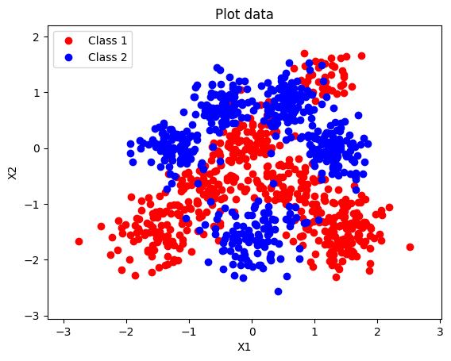
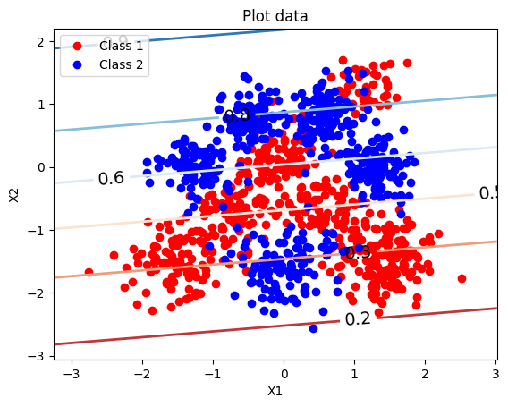
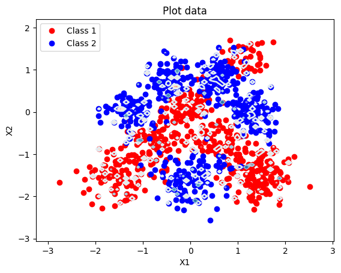
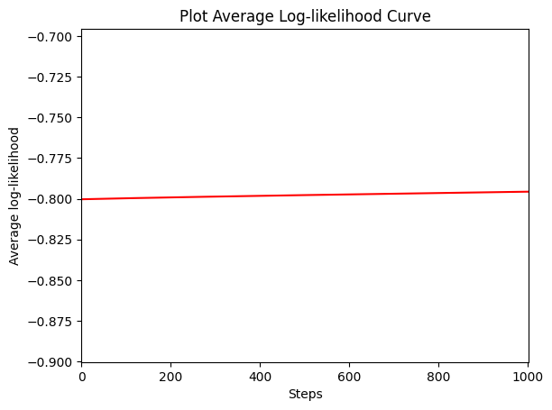
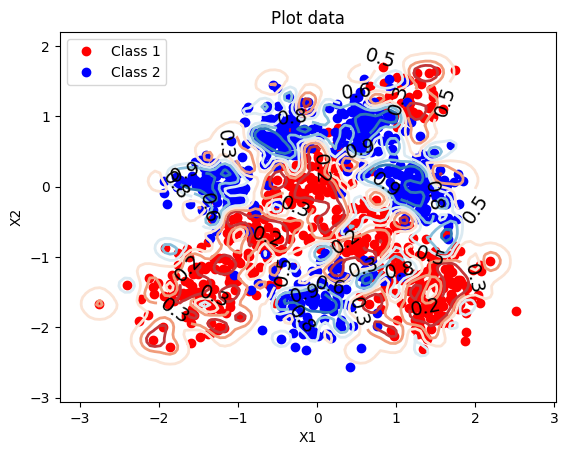
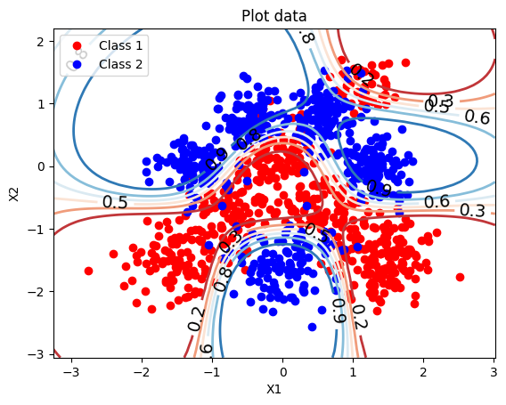

# From Straight Lines to Curved Boundaries: Logistic Regression with RBF Features

## Introduction

Logistic regression is one of the first models you meet in machine learning, and it's tempting to treat it as a solved problem — call `sklearn.linear_model.LogisticRegression`, fit, predict, done. But the moment you implement it from scratch on a non-trivial dataset, the abstraction leaks. "Fitting the model" is a gradient ascent problem with its own convergence behaviour, the model's representational capacity depends entirely on the features you feed it, and the wrong learning rate can make a perfectly good model look broken.

This project was a build-from-scratch implementation of binary logistic regression on a 2D classification problem with overlapping classes. The plan was straightforward: derive the gradient by hand, implement gradient ascent in NumPy, fit a linear model, then enrich the features with Gaussian radial basis functions (RBFs) for non-linear structure. The surprising part — the part I want to write about — was discovering that the supposedly "best" model only revealed its quality after I went back and fixed the learning rate.

<!--more-->

## The data

The dataset is 1,000 points in 2D, labelled into two classes. Plotting them shows the problem:



The classes occupy roughly the same region. There's structure, but no straight line can cleanly separate them — exactly the kind of dataset that makes a linear classifier's limits visible immediately.

## Logistic regression from scratch

Logistic regression models *P(y = 1 | x) = σ(βᵀx̃)*, where σ is the sigmoid and x̃ is the input with a 1 prepended for the bias term. The log-likelihood over the training set decomposes neatly, and its gradient comes out to a clean, vectorisable form:

$$\nabla_\beta \mathcal{L}(\beta) = \tilde{X}^\top (y - \sigma(\tilde{X}\beta))$$

The gradient is the design matrix premultiplying the *residuals* — the gap between actual labels and predicted probabilities. The whole gradient ascent loop is three lines:

```python
for _ in range(n_steps):
    s = sigmoid(X_tilde @ beta)
    grad = X_tilde.T @ (y - s)
    beta = beta + eta * grad
```

With *η = 1/N* (where *N* = 800 training points), the linear model converges in about 50 steps, with train and test log-likelihoods tracking each other closely — no overfitting, no instability, just steady convergence to the best linear classifier this dataset allows.

The decision boundary it finds is exactly what you'd expect:



The p = 0.5 contour is a straight line cutting through the overlap, getting about 68% of Class 0 and 76% of Class 1 right. Meaningful signal — clearly better than chance — but the misclassifications are systematic, not random. They're points the model literally cannot separate with a hyperplane.

## Adding non-linear features

The fix is richer features. A common choice is to replace each input *x* with a vector of Gaussian RBF activations, one centred on each training point:

$$\phi_n(x) = \exp\left(-\frac{\|x - x_n\|^2}{2l^2}\right)$$

The model is *still* logistic regression — linear in its 800-dimensional feature vector — but the features themselves bend the input space. The key hyperparameter is *l*, the bandwidth: small *l* makes each basis function narrow and local; large *l* makes them broad and smooth. I tried *l* ∈ {0.01, 0.1, 1}. Here's where things got interesting.

### l = 0.01: the model that wouldn't learn

With *l = 0.01*, each RBF only fires within a tiny neighbourhood of its centre. The feature matrix becomes effectively block-diagonal: every training point activates its own basis function and almost nothing else. The gradient signal becomes vanishingly small.





The model never escapes its initialisation. The flat learning curve isn't an early-stopping artefact or convergence to a local optimum — the gradient is simply too small to move the parameters. Test LL ≈ −0.70, *worse* than the linear baseline.

### l = 0.1: the well-behaved middle ground

At *l = 0.1*, the basis functions overlap meaningfully but stay local enough to retain detail. The model converges steadily to a smooth, curved boundary that follows the class overlap better than any straight line could:



Test log-likelihood drops to −0.42, and both classes get about 82% accuracy — a clear, balanced improvement over the linear model.

### l = 1: the model that initially looked worse

The first time I ran *l = 1* with the same learning rate I'd been using elsewhere, the training curve oscillated wildly and never settled. The natural conclusion would have been "l = 1 is too smooth for this data." But the contour plot hinted otherwise — the model was *trying* to fit a sensible boundary, it just couldn't sit still.

The diagnosis was the learning rate. With broad basis functions, the feature matrix has a much larger spectral radius — the curvature of the log-likelihood in the dominant direction is steep. The step size that worked fine for narrower kernels was too large here; the parameters overshot the optimum on every step.

I rescaled the learning rate based on the spectral radius of the feature matrix and ran for 5,000 steps. The model converged to test LL = −0.241 — the best of any configuration — with a train/test gap of only 0.019:



This was the result that stuck with me. The model hadn't been bad. The optimiser had been bad. They look identical from the outside.

## Reflections

A few things from this project that I'll keep.

**Capacity and optimiser are entangled.** It's easy to talk about "model capacity" as a property of the model alone, but in practice it's a property of the *(model, optimiser, hyperparameter)* triple. The *l = 1* RBF model has more representational power than the *l = 0.1* one, but you can only see that capacity once the optimiser can actually reach the optimum. A model that converges to the wrong answer and a model incapable of the right answer look the same on a learning curve.

**The spectral radius of the feature matrix isn't an abstract concept.** I'd seen "step size should scale with 1/Lipschitz constant" treated as advice for sophisticated optimisation problems. Watching gradient ascent oscillate because *l = 1* features have different curvature than *l = 0.1* features made it concrete: the conditioning of your features is a real, observable quantity you can compute and use.

**Diagnose by looking at the curves, not just the numbers.** The original *l = 1* model had a bad final test LL, which would naturally suggest "wrong model." But the *shape* of the learning curve — oscillation rather than convergence — pointed at the optimiser, not the model. Treating the curve as a diagnostic signal rather than a summary statistic made the difference between writing this off and getting the best result.

The headline finding is small: with the right kernel width and the right learning rate, RBF logistic regression beats a linear baseline by about 0.4 nats per point of test log-likelihood. The headline *lesson* is bigger: "your model is bad" and "your learning rate is bad" can produce the same symptom.
